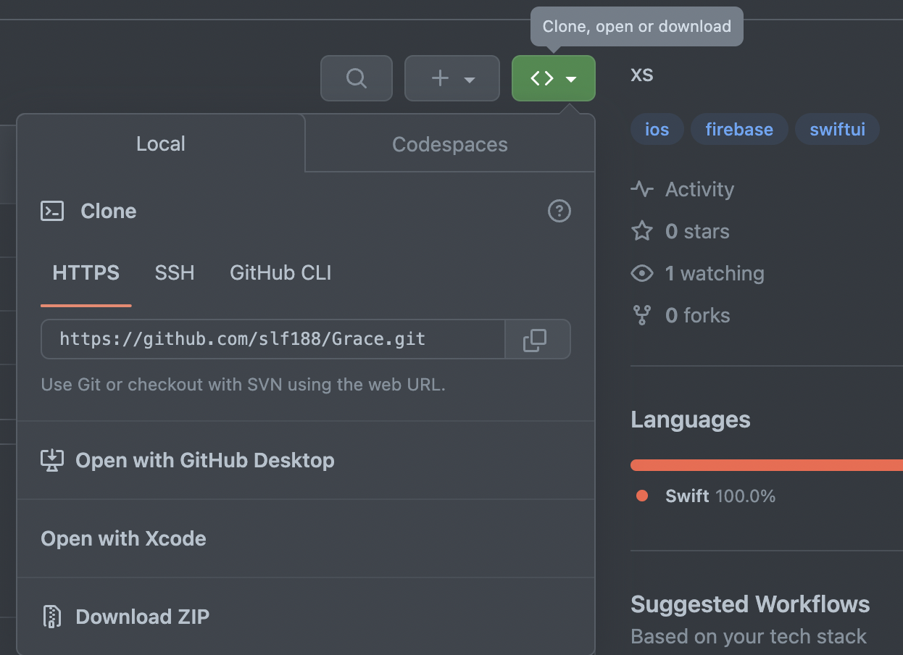

# Grace

## Descripción

Construida con sólidos principios de modelado y arquitecturas de desarrollo de software, Grace es una aplicación iOS que redefine la experiencia del usuario al integrar un diseño modular que facilita la escalabilidad y mantenimiento. Con un modelo de datos robusto y una arquitectura MVVM bien estructurada, ofrecemos un rendimiento optimizado y una navegación fluida, garantizando una aplicación eficiente y fácil de mantener.


## Objetivos del proyecto

1. Mejorar la usabilidad: Optimizar la interfaz de usuario y la experiencia del usuario para garantizar una navegación intuitiva y eficiente, mejorando así la usabilidad general de la aplicación.

2. Incrementar la escalabilidad: Implementar una arquitectura escalable que permita manejar un crecimiento significativo de usuarios y funcionalidades, asegurando un rendimiento constante incluso en situaciones de alta demanda.

3. Reforzar la seguridad: Integrar medidas de seguridad avanzadas para proteger los datos de los usuarios y garantizar la privacidad, cumpliendo con los estándares más rigurosos en la protección de la información.

4. Agilizar el desarrollo: Implementar prácticas de desarrollo ágil para acelerar el ciclo de vida del software, permitiendo entregas más frecuentes y adaptándonos rápidamente a los cambios en los requisitos y tendencias del mercado.

5. Ganar confianza en el uso del IDE Xcode.


## Herramientas utilizadas

- [GitHub](https://github.com/)
- [GitHub CLI](https://cli.github.com/)
- [Fig](https://fig.io/)
- [Hugging Face](https://huggingface.co/)
- [Swift Package Manager](https://github.com/apple/swift-package-manager)
- [Llama 2](https://huggingface.co/)
- [Neovim](https://neovim.io/)
- [Xcode](https://developer.apple.com/xcode/)
- [Chrome](https://www.google.com/chrome/)
- [Hyper](https://hyper.is/)
- [Notion](https://www.notion.so/)
- [StarUML](http://staruml.io/)
- [Git](https://git-scm.com/)
- [Firebase](https://firebase.google.com/)

## Lenguajes utilizados

- [MarkDown](https://www.markdownguide.org/)
- [Shell](https://en.wikipedia.org/wiki/Shell_script)
- [Swift](https://developer.apple.com/swift/)

## Instalación

Para instalar el repositorio se necesita el software Git.

En el terminal de la computadora escribir los siguientes comandos:

```zh
$ ls
$ cd [ubicación deseada en la computadora para ubicar la carpeta]
$ git init
$ git clone [el codigo HTTPS del repositorio]

```

En caso de que no se disponga de Git en la computadora, se puede instalar el repositorio en forma de ZIP, presionando en donde dice "Download ZIP".



## Referencias

- [GitHub Gitignore Swift](https://github.com/github/gitignore/blob/main/Swift.gitignore)
- [About remote repositories](https://docs.github.com/en/get-started/getting-started-with-git/about-remote-repositories#cloning-with-https-urls)
- [What is the @State property wrapper?](https://www.hackingwithswift.com/quick-start/swiftui/what-is-the-state-property-wrapper#:~:text=SwiftUI%20uses%20the%20%40State%20property,shared%20storage%20managed%20by%20SwiftUI)
- [What is the @Binding property wrapper?](https://www.hackingwithswift.com/quick-start/swiftui/what-is-the-binding-property-wrapper)
- [Command CompileSwift failed with a nonzero exit code in Xcode 10 [duplicate]](https://stackoverflow.com/questions/52387452/command-compileswift-failed-with-a-nonzero-exit-code-in-xcode-10/53007533#53007533)
- [How do I properly force a Git push?](https://stackoverflow.com/questions/5509543/how-do-i-properly-force-a-git-push)
- [Changing image size in Markdown](https://stackoverflow.com/questions/14675913/changing-image-size-in-markdown)
- [SwiftUI Manual](https://developer.apple.com/documentation/swiftui/)
- [Firebase Authentication](https://firebase.google.com/docs/auth/ios/password-auth)
- [Firebase Firestore](https://firebase.google.com/docs/firestore)
- [Firebase Storage](https://firebase.google.com/docs/storage)
- [Firesbase Security Rules](https://firebase.google.com/docs/rules)

## Licencia

[LICENSE](LICENSE)

## Autor

[Felipe Vallejo](https://twitter.com/slf188)
