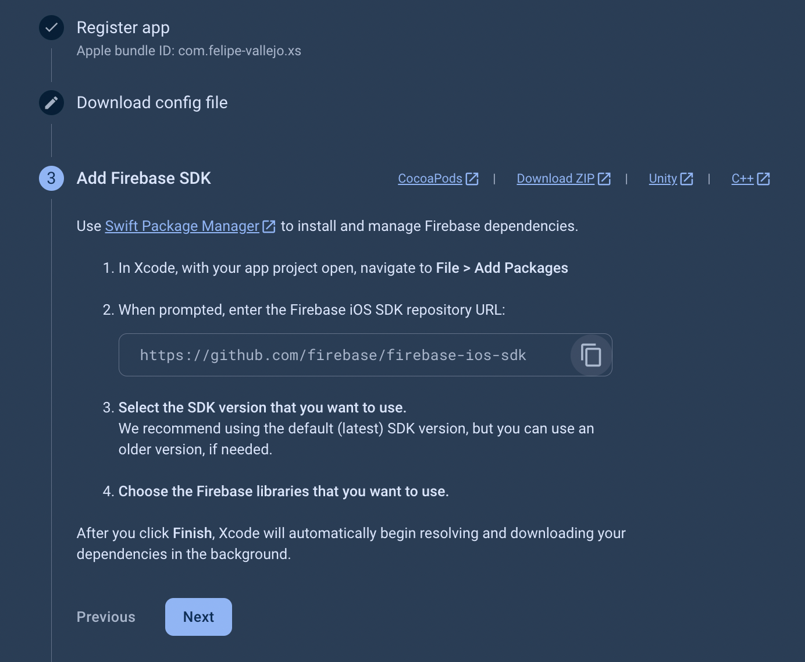
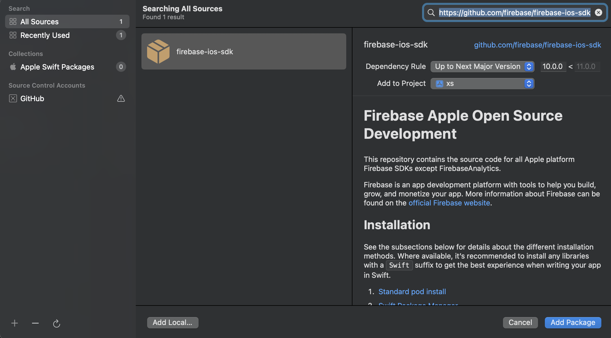
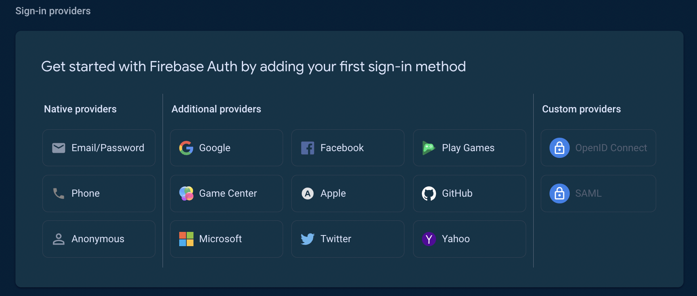
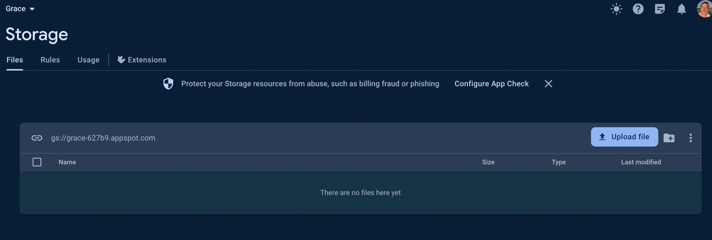
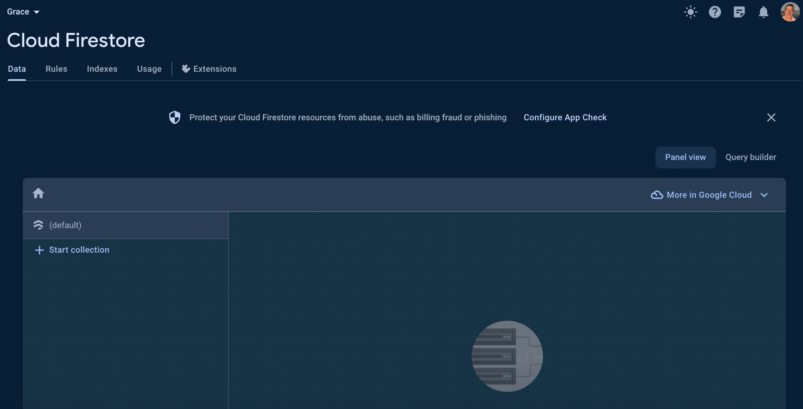
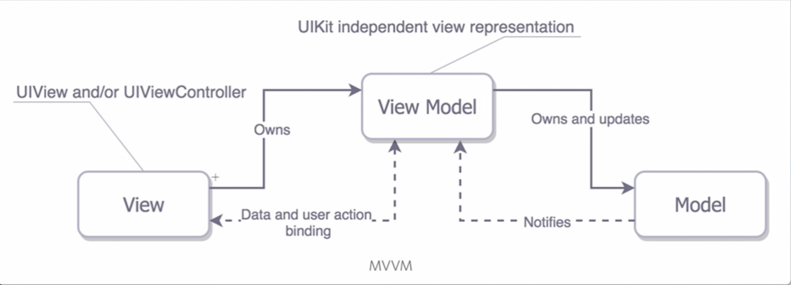
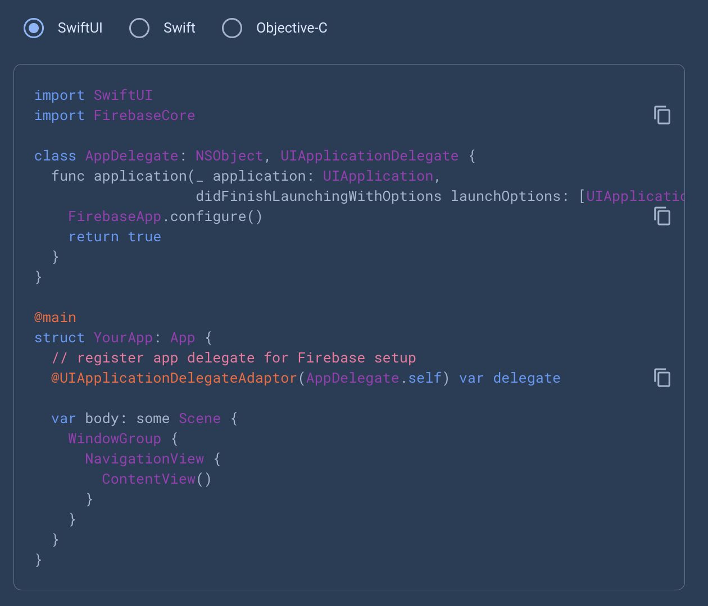
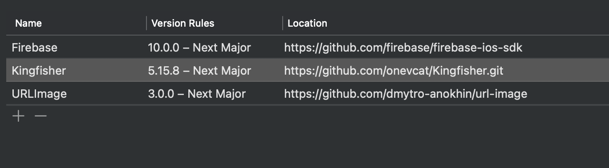

# Capturas

## Cuando registré por primera vez la app en Firebase:

## Cuando se instalaron las dependencias en el proyecto:

## Cuando elegí el método de autenticación de la app:

## La carpeta de almacenamiento (storage) en Firebase cuando aún no registré ningún usuario:

## Firestore cuando estuvo recién inicializado:

## Arquitectura MVVM:

## Configuración que se tuvo que hacer dentro del proyecto cuando integramos Firebase:

## Las dependencias del proyecto:

